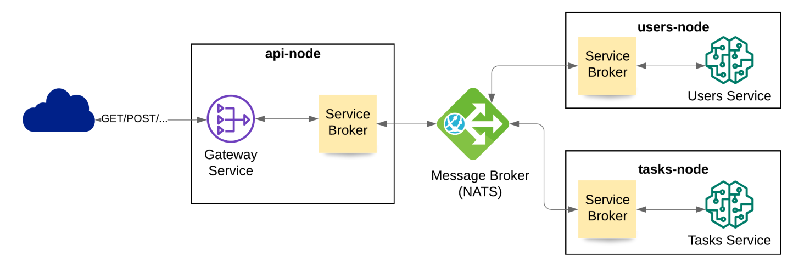
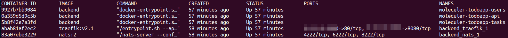

# ToDo App - A microservices demo using Moleculer framework for Node.js

[Click here](http://nery.tech/moleculer-todoapp/) to see a live demo of this application.

## Technology Stack

* React.js
* Material-UI
* MongoDB
* Mongoose
* Moleculer
* Node.js
* Docker

## Application architecture

Working with Moleculer makes it super easy to deploy a scalable microservices architecture. This application is built as show in the following diagram:

All nodes are loosely coupled which means that we can deploy this application in such a way that is resilient, scalable and fault tolerant. We can spin-up as many nodes as we need per service.

## Running this project in your local environment

### Frontend

1. cd frontend
1. npm install
1. create file `.env.development.local` in the frontend directory and add the following content to this file:  `REACT_APP_API_URL=http://localhost:4000/api`
1. npm start

### Backend

1. cd backend
1. npm install
1. create directory `config`
1. create file `dev.env` inside `config` directory
1. Add this content to `dev.env` : 

`
MONGODB_URL=<your mongo url pointing to application db>  # for example: MONGODB_URL=mongodb://127.0.0.1:27017/moleculer-todoapp
PORT=4000
`

6. go back to `backend` folder
7. npm run dev

**To run unit tests**

1. create file `test.env` inside `config` directory
1. Add following content 

`
MONGODB_URL=<your mongo url pointing to test db> # for example: MONGODB_URL=mongodb://127.0.0.1:27017/moleculer-todoapp-test
`

3. Now, go back to `backend` folder and run `npm run test`

### Running docker containers

The above instructions basically run the application in a monolitic way. To run independent nodes per service, Moleculer includes a handy script that creates a docker container per service. To deploy the containers, `cd` into the `backend` folder and simply run:

`npm run dc:up`

This will create the needful images and build the containers. For instance, here is the output of `docker ps` from the [live demo](http://nery.tech/moleculer-todoapp/) server of this app:

